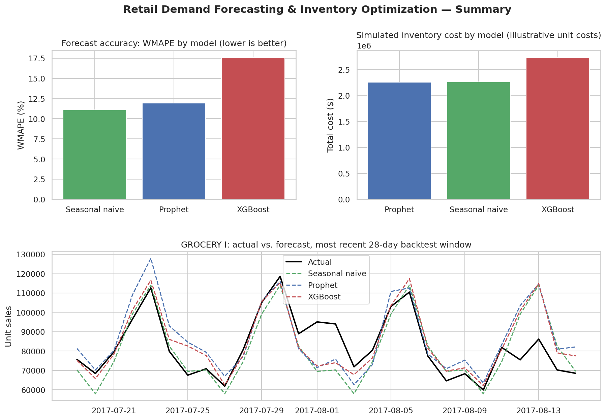

# Retail Demand Forecasting & Inventory Optimization

Predicting product-level retail demand and translating those forecasts into
inventory decisions (safety stock, reorder points, service levels) using the
Corporación Favorita grocery sales dataset.

This project is a working proof-of-concept for the demand forecasting and
inventory optimization components of my AI-Powered Predictive Supply Chain
Resilience Framework — see [Methodology](#methodology) below.

## Problem

Retailers lose sales to stockouts and tie up cash in overstock because
demand forecasts are often built on intuition rather than evidence. This
project builds and evaluates predictive models against that problem on a
real, public retail dataset, then shows what the forecast improvement is
worth in inventory terms.

## Data

Corporación Favorita Grocery Sales Forecasting (Kaggle) — several years of
daily unit sales across thousands of products and dozens of stores in
Ecuador, plus store, item, holiday, oil-price, and transaction metadata.
See `data/README.md` for how to download it.

## Methodology

1. **Data consolidation & cleaning** — merge sales, store, item, holiday,
   and oil-price data; handle missing values and outliers; validate
   consistency.
2. **Forecasting models**, compared on the same holdout:
   - Naive / seasonal-naive baseline
   - Statistical model (SARIMA or Prophet)
   - Machine-learning model (XGBoost or LightGBM) with engineered features
     (lags, rolling stats, calendar/holiday effects, price/promo signals)
3. **Evaluation** — rolling-origin (walk-forward) backtesting, scored on
   MAPE, WMAPE, and bias, so accuracy is measured the way it would hold up
   in production, not on a single lucky train/test split.
4. **Inventory optimization** — convert forecast + forecast error into
   safety stock and reorder points at a target service level, then compare
   projected stockout and overstock cost against a naive-forecast baseline.
5. **Reporting** — a results dashboard (rebuilt in Tableau) and a written
   summary of what the better forecast is worth in dollar terms.

## Results

4-fold rolling-origin backtest, 28-day forecast horizon, averaged across
the 8 scoped product families (see `notebooks/02_forecasting_models.ipynb`
for the full breakdown by fold and family):

| Model | MAPE | WMAPE | Bias |
|---|---|---|---|
| Seasonal-naive baseline | 10.5% | 11.1% | -1.1% |
| Prophet | 11.8% | 11.9% | -0.5% |
| XGBoost (recursive, global) | 17.8% | 17.6% | +10.5% |

The seasonal-naive baseline held up best on average — weekly retail
seasonality here is strong and stable enough that "same day last week"
is a hard baseline to beat. XGBoost was competitive on steadier
categories (BEVERAGES, CLEANING) but degraded on volatile, perishable
ones (MEATS, POULTRY): forecasting recursively over a 28-day horizon lets
errors compound, fastest on the noisiest series. That diagnosis, not a
tuned-away number, is the point — see the notebook for the full
discussion and the documented next step (a direct multi-step model).

Estimated inventory cost impact: simulating a forecast-driven reorder
policy (95% target service level, 7-day lead time) against actual demand
across the same backtest windows, Prophet's forecast produced the
lowest total simulated inventory cost, about **17% lower than XGBoost's**
and roughly on par with the seasonal-naive baseline — see
`notebooks/03_inventory_optimization.ipynb` for the full breakdown,
methodology, and stated assumptions (illustrative unit costs, since the
source dataset has no price data).

## Dashboard



The chart data behind this is exported as tidy CSVs in
`reports/tableau_export/` — `daily_actual_vs_forecast.csv`,
`model_comparison_summary.csv`, and `family_level_summary.csv` — built to
be dropped straight into Tableau or Power BI: connect to the folder,
build a line chart of actual vs. predicted filtered by model/family, and
KPI cards from the summary tables.

## Project structure

```
data/           raw (not committed) and processed data
notebooks/      exploratory analysis
src/            reusable pipeline code (data prep, models, inventory, evaluation)
reports/        figures and written results
tests/          unit tests for src/
```

## Setup

```
python -m venv venv
source venv/bin/activate   # venv\Scripts\activate on Windows
pip install -r requirements.txt
```

Then either run the notebooks in order (`01` → `02` → `03`), or run the
tests:

```
pytest tests/
```

## Author

Mithila Zaman Samapti — Supply Chain Analytics & Procurement Manager
